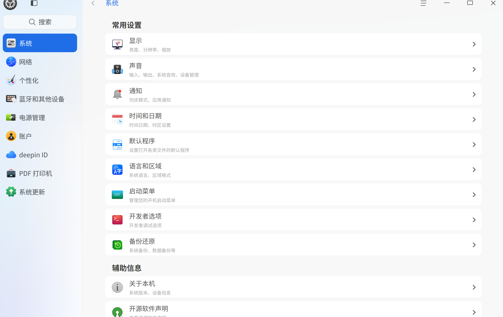
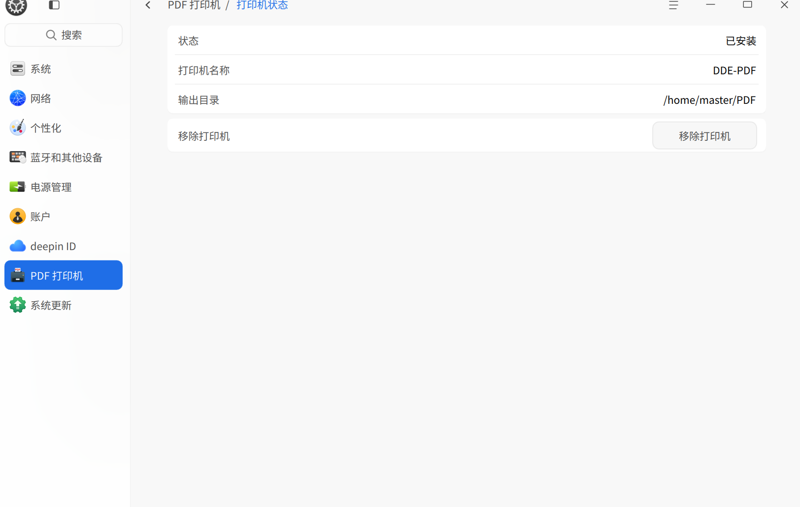
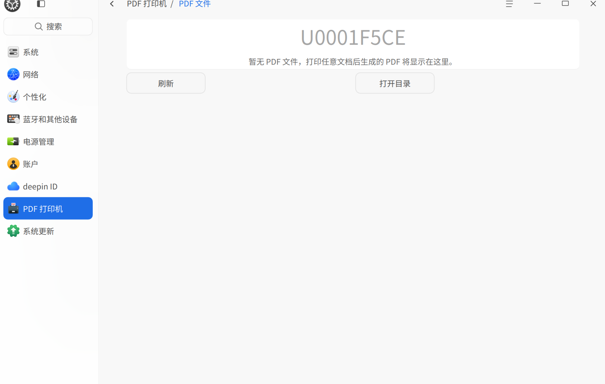
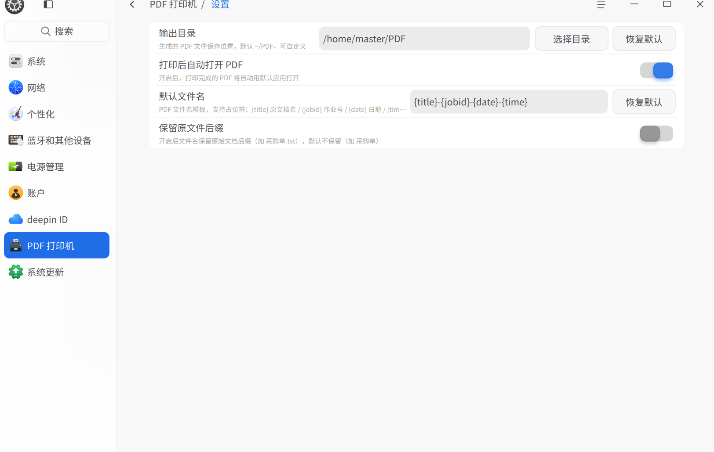
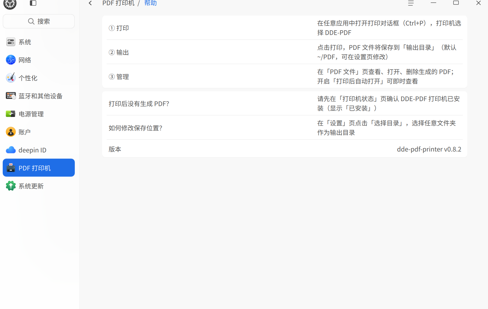
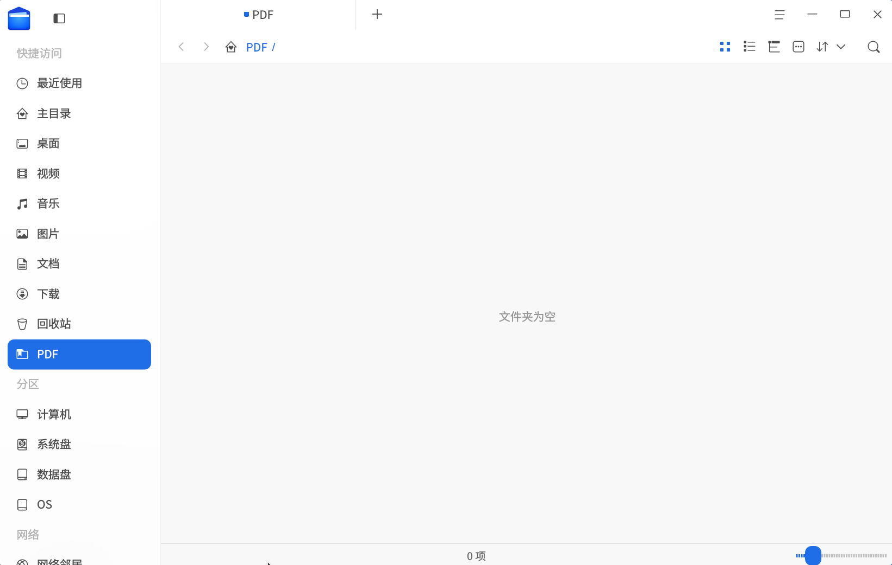

# deepin-pdf-printer

> deepin/UOS v25 的虚拟 PDF 打印机 —— 类似 Windows 的「Microsoft Print to PDF」。

在任意应用的打印对话框中选择 **Deepin-PDF**，即可将文档输出为 PDF 文件保存到指定目录，并通过 **DDE 控制中心**插件进行管理。

> 🏆 deepin「10 亿 Token 奖池写插件」大赛参赛作品

---

## ✨ 功能特性

- **任意应用打印为 PDF**：CUPS 虚拟打印机，打印对话框直接可用
- **控制中心管理模块**「PDF 打印机」：
  - 📊 **状态页**：查看打印机状态，一键安装 / 移除打印机
  - 📄 **PDF 文件列表**：浏览输出目录的 PDF（名称 / 大小 / 时间），打开、删除、打开目录
  - ⚙️ **设置页**：自定义输出目录（原生目录选择器）、**自定义文件名模板**、**保留原文件后缀开关**、打印后自动打开 PDF
  - ❓ **帮助页**：三步使用引导 + 常见问题 + 版本号
- **自定义 PDF 文件名**：支持 `{title}` / `{jobid}` / `{date}` / `{time}` 占位符模板（默认 `{title}-{jobid}-{date}-{time}`），可选保留原文档后缀
- **输出目录可自定义**：backend 与插件统一读取配置，修改后全局生效
- **多架构支持**：GitHub Actions 自动构建 **amd64 / arm64 / loong64** 三架构 deb 并发布 Release
- **功能调用日志**：每次操作记录到 `~/.cache/deepin/dde-control-center/pdfprinter.log`（含版本号）
- **中文界面** + DCI 图标，融入 deepin 设计语言
- **安装即用**：deb 包 postinst 自动创建打印机

## 🖼️ 截图

| 控制中心入口 | 打印机状态 |
| --- | --- |
|  |  |

| PDF 文件列表 | 设置 |
| --- | --- |
|  |  |

| 帮助 | 输出目录（生成的 PDF） |
| --- | --- |
|  |  |

## 📦 安装

```bash
# 方式一：下载 Release deb（支持 amd64 / arm64 / loong64）
# https://github.com/Re-s/dde-virtual-pdf-printer/releases 选择对应架构
sudo dpkg -i deepin-pdf-printer_*.deb

# 方式二：从源码构建（见下方「构建」）
```

安装后打开控制中心 → 「PDF 打印机」即可管理；任意应用打印对话框选择 **Deepin-PDF** 输出 PDF。

## 🚀 使用

1. 打开任意文档（WPS、浏览器、LibreOffice 等）→ 打印（Ctrl+P）
2. 打印机选择 **Deepin-PDF** → 打印
3. PDF 保存到默认 `~/PDF/` 目录（可在控制中心设置页修改输出目录、**文件名模板**、是否**保留原文件后缀**）
4. 控制中心「PDF 打印机 → PDF 文件」可查看、打开、删除

## 🔧 构建

### 1. 编译环境安装（首次构建需要）

```bash
# 基础工具链
sudo apt install -y build-essential cmake git

# Qt6 开发包
sudo apt install -y qt6-base-dev qt6-declarative-dev qt6-tools-dev linguist-qt6 libxkbcommon-dev

# DTK6（deepin 应用框架）
sudo apt install -y libdtk6core-dev libdtk6gui-dev libdtk6widget-dev

# 控制中心插件开发包（提供 DCC_FACTORY_CLASS / dcc_install_plugin）
sudo apt install -y dde-control-center-dev

# 运行时依赖（backend + CUPS 打印链路）
sudo apt install -y cups cups-filters ghostscript
```

> 注：deepin 25 的 `dde-control-center-dev` 提供 `dccfactory.h` 与 CMake 配置
> （`find_package(DdeControlCenter)`）。若系统 curl 被沙箱 LD_LIBRARY_PATH 污染，
> 用 `env -u LD_LIBRARY_PATH cmake ...` 构建。

### 2. 构建插件

```bash
# 构建控制中心插件（QML 编译进 lib<name>_qml.so）
cmake -S src/plugin -B build/integration -DCMAKE_INSTALL_PREFIX=/usr
cmake --build build/integration -j$(nproc)
```

### 3. 打包 deb（backend + 插件 + 翻译 + 图标 + postinst）

```bash
# 组装安装目录（make install 到临时目录，插件路径由 CMake 决定）
cmake --install build/integration --prefix /usr --strip 2>/dev/null || \
  (cd build/integration && make install DESTDIR=/tmp/inst)

# 打包（ci/package-deb.sh 自动收集 backend/插件/翻译/图标/DEBIAN 脚本）
SRC_DIR=$PWD INST_DIR=/tmp/inst bash ci/package-deb.sh amd64 0.7.2
# 产物：deepin-pdf-printer_0.7.2_amd64.deb
```

**依赖**：`cups`、`cups-filters`、`ghostscript`、`dde-control-center`、Qt6（Core/DBus）、DTK6

### 4. 多架构自动构建（GitHub Actions）

仓库已配置 `.github/workflows/build-deb.yml`，**打 tag 自动构建三架构并发布 Release**：

```bash
git tag -a v0.8.0 -m "..." && git push origin v0.8.0
```

- `amd64`（原生 runner）/ `arm64`（原生 arm runner）/ `loong64`（QEMU 用户态模拟）
- 构建方式：debootstrap deepin beige rootfs 隔离构建（不污染 runner）
- 构建成功自动创建/更新 Release 并上传三个架构 deb
- 只推代码不想构建：commit message 加 `[skip ci]`

> 🤖 **AI 二次开发**：clone 仓库后，AI 编程助手（Cursor / Claude Code / Codex 等）会自动加载
> [`AGENTS.md`](AGENTS.md) —— 内含架构速览、构建铁律、全部踩坑经验与验证清单，
> 可安全交给 AI 进行二次开发。

## 📁 项目结构

```
deepin-pdf-printer/
├── backend/deepinpdf          # CUPS backend（Python，root 运行，写 PDF）
├── src/
│   ├── service/               # 服务层：PrinterManager / ConfigManager / OutputDirWatcher
│   └── plugin/
│       ├── operation/         # 插件 C++ 逻辑（PdfPrinterModule）
│       ├── qml/               # 控制中心页面（状态/文件列表/设置）
│       └── translations/      # 中文翻译
├── assets/icons/              # DCI 图标
├── debian/                    # deb 打包（control/rules/postinst 等）
└── docs/                      # 设计文档 / 论坛调研 / 安全审查
```

## 💡 技术细节

- **backend 权限 700（root:root）**：CUPS 对带 world 执行位的 backend 以 `lp` 用户运行，无法读取用户 700 的 `~/.config`；700 强制 root 运行，backend 内部用 `pwd.getpwnam()` 获取目标用户家目录并 `chown` 输出文件
- **目录选择用 D-Bus**：dde-control-center 是纯 QML 应用（无 QApplication），`QFileDialog` 会崩溃、QML `FolderDialog` 被 dde-file-dialog 接管行为不可控；改为异步调用 `com.deepin.filemanager.filedialog` 服务（`createDialog` → `acceptMode=Directory` → `selectedUrls`）
- **配置存储**：QSettings `~/.config/org.deepin.dde.pdfprinter/pdfprinter.conf`，backend 与插件统一读取
- **ostree 适配**：deepin 25 的 `/usr` 只读，安装必须走 deb 包（dpkg 有专用写路径）

## 📄 许可证

GPL-3.0-or-later

## 🏆 参赛说明

- 开发过程文档：`docs/design.md`（架构设计）、`docs/forum-print-survey.md`（需求调研，27 篇论坛帖子支撑）、`docs/security-audit.md`（安全审查）
- 基于 deepin Skills 开发（dde-control-center-development / dtk-development）
